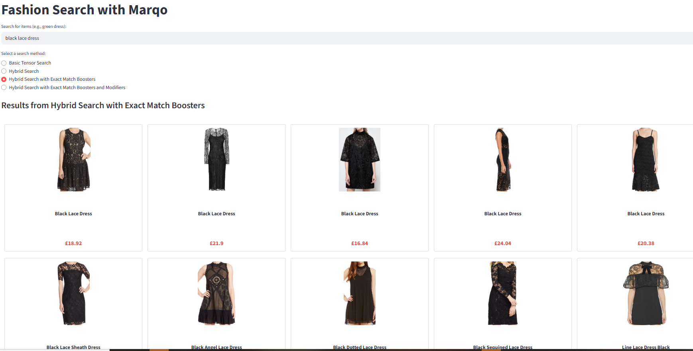

# Fashion Search with Marqo
This repository shows you how to build a personalized fashion search engine with [Marqo](https://www.marqo.ai/). We’ll start by collecting and preparing product and historical search data, then guide you through creating an index, adding documents, and using advanced search techniques like exact match boosters and revenue modifiers to enhance relevance and drive conversions.

There is an article that guides you through the process in more detail. Read it [here](https://marqo.ai/blog/improving-search-relevance-in-fashion).

<p align="center">
  
</p>

## Step 0: Set Up
First, you will need a Marqo Cloud API Key. To obtain this, visit this [article](https://www.marqo.ai/blog/finding-my-marqo-api-key).
Once you have your API Key, place it inside a `.env` file such that:
```env
MARQO_API_KEY = "XXXXXXXX"   # Visit https://www.marqo.ai/blog/finding-my-marqo-api-key 
```

To install all packages needed for this search demo:
```bash
python3 -m venv venv
source venv/bin/activate   # or venv\Scripts\activate for Windows
pip install -r requirements.txt
```

## Step 1: Data Processing
The first step is to generate your fashion data. To build an effective search system, you need two key types of data: product and historical search. 

Product data contains static, descriptive attributes about each item in the catalogue. This includes fields such as product images, titles, descriptions, categories, and stock status. 

Historical data can be obtained from search logs. Search logs capture event-level interactions between users and the search system. These logs record each action (e.g., view, click, add to cart, purchase) that a user performs after submitting a query.

### Product Data
For this demo, we use a 15k subset of the [`Marqo/fashion200k`](https://huggingface.co/datasets/Marqo/fashion200k) dataset. To simulate a real-world scenario, we’ve added fields like product cost and stock status, which are crucial for filtering and ranking search results. The product data csv can be found [here](./data_processing/data/product_data.csv).

The data is in the form:
```bash
image_url,_id,product_name,category,cost,in_stock
https://marqo-tutorial-public.s3.us-west-2.amazonaws.com/fashion/fashion200k/16066811_1.jpeg,16066811_1,black skinny cotton twill cargo pants,pants,17.6,True
...
```

### Search Log
For this article, we curated search log data to reflect the behaviour of users on a fashion website. The product data csv can be found [here](https://marqo-tutorial-public.s3.us-west-2.amazonaws.com/fashion/fashion-search-demo/search_log.csv). Once downloaded, place into the `data_processing/data` folder. The data is in the form:
```csv
query,_id,action,days_ago_action_performed
green candy dress,91055827_0,click,30
green candy dress,91055827_0,click,28
green candy dress,71246356_0,purchased,1
green candy dress,71246356_0,purchased,1
```
Each row represents a single interaction for a given query and product. However, to make this data useful for search optimization, it needs to be processed and aggregated. By grouping the raw event data by query-item pairs, we can derive key metrics such as total purchases, add-to-cart counts, total clicks, and revenue. This aggregated data, combined with product data, forms the basis of historical search data.

### Historical Data
Historical data helps optimise search relevance by highlighting popular products for specific queries. For given queries, we are able to collect information about what products are returned in the search and how well these products perform. We have metrics such as total purchases, total click count, revenue (over three different periods) which are all key indicators about the popularity of a given item. 

We have included the historical data CSV [here](./data_processing/data/historical_data.csv) but if you want to reproduce this dataset for yourself, you can run `python3 data_processing/generate_historical_data.py`. Feel free to substitute your own data in here (given it's structured in the same way as the search log).

The historical data now looks like:
```csv
query,_id,total_purchases,add_to_cart_count,total_click_count,one_day_revenue,three_day_revenue,five_day_revenue
$58 multicolor pants compare,89199404_0,13,99,105,64.14,277.94,277.94
1 dress shoulder tank,73633821_1,26,49,194,503.62,503.62,503.62
1 dress tank black,73633821_1,12,53,63,154.96,213.07,232.44
```

### Merged Data
Now we have our product data and historical data, we can merge these two datasets together. To merge the two datasets together, run `python3 data_processing/generate_merged_data.py`. This gives you a dataset that looks as follows:

```csv
query,_id,total_purchases,add_to_cart_count,total_click_count,one_day_revenue,three_day_revenue,five_day_revenue,image_url,product_name,category,cost,in_stock
$58 multicolor pants compare,89199404_0,13,99,105,64.14,277.94,277.94,https://marqo-tutorial-public.s3.us-west-2.amazonaws.com/fashion/fashion200k/89199404_0.jpeg,multicolor woven pants compare $58,pants,21.38,True
1 dress shoulder tank,73633821_1,26,49,194,503.62,503.62,503.62,https://marqo-tutorial-public.s3.us-west-2.amazonaws.com/fashion/fashion200k/73633821_1.jpeg,black 1 shoulder tank dress,dresses,19.37,True
1 dress tank black,73633821_1,12,53,63,154.96,213.07,232.44,https://marqo-tutorial-public.s3.us-west-2.amazonaws.com/fashion/fashion200k/73633821_1.jpeg,black 1 shoulder tank dress,dresses,19.37,True
1 midi gray slip,91270795_0,12,42,79,91.45,164.61,219.48,https://marqo-tutorial-public.s3.us-west-2.amazonaws.com/fashion/fashion200k/91270795_0.jpeg,gray 2 1 cami slip midi dress,dresses,18.29,True
```

All that's left to do is export this data into a JSON so that we can load the documents into Marqo, ready to begin searching. We also add to our documents `exact_match_boosters` which is the product name of the item. This way, if a user searches for the exact product name, it appears at the top of the search results. 

We also add modifiers into the data. We can use modifiers at query time by inserting the user submitted query into the modifiers, if it matches then it will get boosted, if it doesn’t then it just adds 0 to the score and has no impact. By including these modifier fields in the documents, it allows these items to be weighted for better search results.

Thus, each document will look as follows:
```json
{
        "image_url": "https://marqo-tutorial-public.s3.us-west-2.amazonaws.com/fashion/fashion200k/2307458_0.jpeg",
        "_id": "2307458_0",
        "product_name": "black lace sheath dress",
        "category": "dresses",
        "cost": 18.37,
        "in_stock": true,
        "exact_match_boosters": {
            "black_lace_sheath_dress": 1000
        },
        "one_day_revenue_modifiers": {
            "lace_sheath_dress_black": 367.4,
            "sheath_dress_lace_black": 330.66
        },
        "three_day_revenue_modifiers": {
            "lace_sheath_dress_black": 385.77,
            "sheath_dress_lace_black": 679.69
        },
        "five_day_revenue_modifiers": {
            "lace_sheath_dress_black": 385.77,
            "sheath_dress_lace_black": 679.69
        }
    },
```
This data can be found at the `complete_data.json` document we have [here](./data_processing/data/complete_data.json). If you want to compute this for your own data, run `python3 data_processing/generate_modifiers.py` (this may take a couple of minutes).

For more information on the modifiers used here, please see our full [blog post](https://marqo.ai/blog/improving-search-relevance-in-fashion).

## Step 2: Creating Marqo Index
Now we have discussed the types of data needed for successful search, we can begin building with Marqo. 

### Create Marqo Index 
First, create your Marqo index:
```bash
python3 marqo/create_index.py
```

If you visit [Marqo Cloud](https://cloud.marqo.ai/indexes/), you will be able to see the status of your index (and when it's ready to add documents to).

### Add Documents
Now we have created our Marqo index, we can begin adding documents to it.

```bash
python3 marqo/add_documents.py
```
This will take the documents in `complete_data.json` and begin adding them to Marqo. You can expect this to take 10-15 minutes.

While the data is being added, you can check the status of your index with `python3 marqo/get_stats.py` or visit [Marqo Cloud](https://cloud.marqo.ai/indexes/). Within the marqo folder in this repository, there are also some Python scripts that show you how to delete specific documents, delete all documents, and some test searches too. Feel free to run these scripts when/if needed. 

## Step 3: Searching 
For this demo, we have created a streamlit app interface for you to interact with your data. To set this up run, 
```bash
streamlit run app.py
```
This will launch a user interface that looks similar to the following when you begin querying:

<p align="center">
  
</p>

Note, there are 4 different search method options:
* Basic tensor search
* Hybrid search
* Hybrid search with exact match boosters
* Hybrid search with exact match boosters and modifiers

For more information on the specifics of these 4 different methods and how they impact search revenue, visit our [blog](https://marqo.ai/blog/improving-search-relevance-in-fashion).

## Step 4: (Optional) Clean Up
If you follow the steps in this guide, you will create an index with GPU inference and a basic storage shard. This index will cost $1.03 per hour. When you are done with the index you can delete it with the following code:
```bash
python3 marqo/delete_index.py
```

## Next Steps
For more information on how Marqo can help you achieve a fully state-of-the-art search system, [book a demo](https://www.marqo.ai/book-demo?utm_source=github&utm_medium=organic&utm_campaign=marqo) or [contact us](https://www.marqo.ai/contact?utm_source=github&utm_medium=organic&utm_campaign=marqo). 
